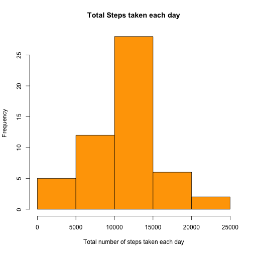
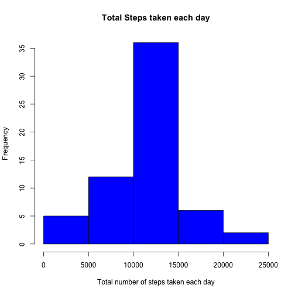

Reproducible Research: Peer Assessment 1
---


## Global options and parameters

```r
#setwd("~/Documents/Coursera/datascience_jh/represearch/RepData_PeerAssessment1")
# set echo = TRUE globally. This is the default, setting it explicitly here
opts_chunk$set(echo = TRUE)

# we will be using the packages knitr to convert to markdown and html
# Using knit2html will generate the .md and .html files in the same directory
# as the working directory. A directory called figures will also be created 
# under the working directory if plots are generated.
library(knitr)
```


## Loading and preprocessing the data

```r
if (!file.exists('activity.csv')){
    unzip("activity.zip")
}
activity <- read.csv("activity.csv", header = TRUE)
```


## What is mean total number of steps taken per day?

```r
# calculate total number of steps grouped by day
totstepsbyday <- aggregate(steps~date, activity, sum, na.rm = TRUE)
# Q1 - Make a histogram of the total number of steps taken each day

hist(totstepsbyday$steps, col = "orange", main = "Total Steps taken each day",
      xlab = "Total number of steps taken each day")
```

 

```r
# Q2 - Calculate and report the mean and median total number of steps taken per day
meanstepsbyday <- round(mean(totstepsbyday$steps))
medianstepsbyday <- median(totstepsbyday$steps)
```
#### The mean and median total number of steps taken per day are 1.0766 &times; 10<sup>4</sup> and 10765


## What is the average daily activity pattern?

```r
# Q1 - Make a time series plot (i.e. type = "l") of the 5-minute interval (x-axis) 
# and the average number of steps taken, averaged across all days (y-axis)

# calculate the average number of steps grouped by interval
avgstepsbyinterval <- aggregate(steps~interval, activity, mean)
# generate line chart
plot(avgstepsbyinterval$interval, avgstepsbyinterval$steps, type = 'l', col = 1, 
     main = "Average number of steps across all days",
     xlab = "Interval in minutes",
     ylab = "Average number of steps")
```

 

```r
# Q2 - Which 5-minute interval, on average across all the days in the dataset, 
# contains the maximum number of steps?

# find the row that has the maximum number of steps
rowWithMax <- which.max(avgstepsbyinterval$steps)
# get the values for the interval and steps corresponding to the rowWithMax row
avgstepsbyinterval[rowWithMax, ]
```

```
##     interval steps
## 104      835 206.2
```
#### The interval 835 corresponds to the maximum average number of steps  206.1698


## Imputing missing values

```r
# Q1. Calculate and report the total number of missing values in the dataset 
# (i.e. the total number of rows with NAs)

# subset activity data frame to get rows with steps = NA
onlyNA <- subset(activity, is.na(steps))
rowcountNA <- nrow(onlyNA)
```
#### The total number of missing values in the dataset is 2304.

```r
# Q2 - Devise a strategy for filling in all of the missing values in the dataset. 
# The strategy does not need to be sophisticated. For example, you could use the
# mean/median for that day, or the mean for that 5-minute interval, etc.
# use sqldf for getting and setting missing values
# use the mean value for an interval to substitute for NAs

library(sqldf)

# create a dataframe that combines the avgstepsbyinterval data frame with the 
# onlyNA data frame
interimdf <- sqldf("select round(a.steps) a_st, a.interval a_int, na.steps na_st,na.interval na_int,
na.date from avgstepsbyinterval a join onlyNA na on a.interval = na.interval")

# create a new activity dataframe with NAs filled in
activityfilled <- sqldf("select a.date, a.interval, coalesce(t.a_st,a.steps) steps
                        from activity a left outer join tst t 
                        on (a.date = t.date and a.interval = t.na_int)")

# calculate total number of steps grouped by day
totstepsbydayfill <- aggregate(steps~date, activityfilled, sum)

# create histogram
hist(totstepsbydayfill$steps, col = "blue", main = "Total Steps taken each day",
      xlab = "Total number of steps taken each day")
```

 

```r
meanstepsbydayfill <- round(mean(totstepsbydayfill$steps))
meanstepsbydayfill
```

```
## [1] 10766
```

```r
medianstepsbydayfill <- median(totstepsbydayfill$steps)
medianstepsbydayfill
```

```
## [1] 10762
```
#### The mean for the dataset with NAs present is 1.0766 &times; 10<sup>4</sup>.
#### The mean for the dataset with NAs filled in is 1.0766 &times; 10<sup>4</sup>.
#### The median for the dataset with NAs present is 10765.
#### The median for the dataset iwth NAs filled in is 10762.
#### Imputing missing data has no difference on the mean but has a slight impact on the median.


## Are there differences in activity patterns between weekdays and weekends?
